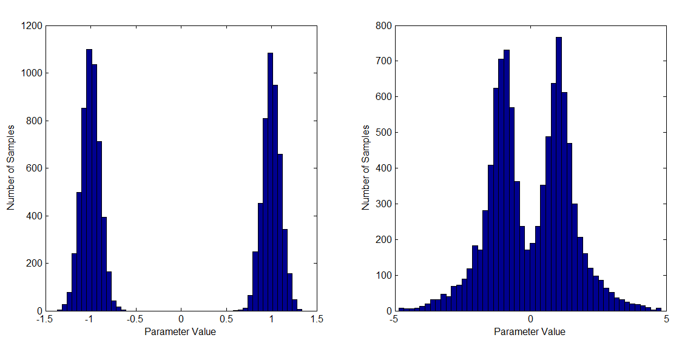
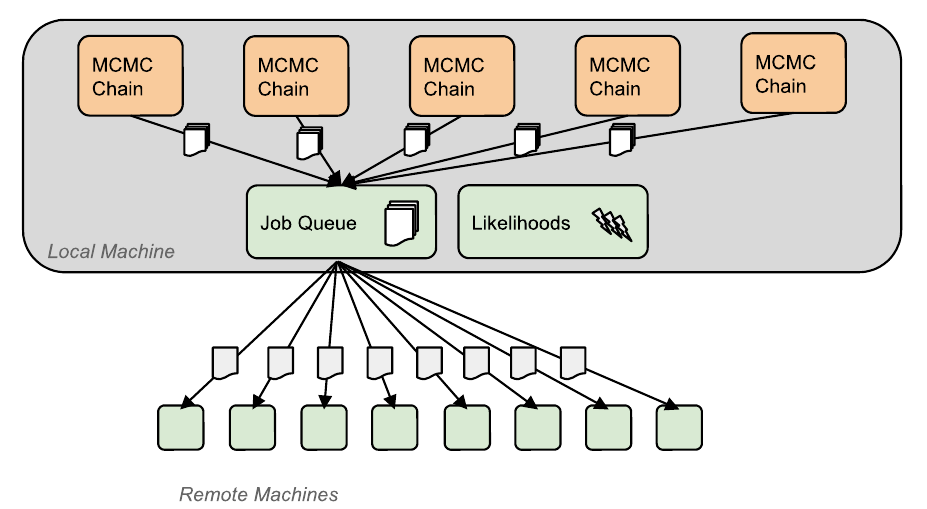

#stateline

[](https://travis-ci.org/NICTA/stateline)


- [Introduction](#introduction)
    - [MCMC Sampling](#primer-mcmc-sampling)
    - [Why Stateline](#why-stateline)
- [System Requirements](#system-requirements)
- [Installation](#building)
- [Getting Started](#getting-started)
    - [Configuration](#configuration)
    - [C++ Example](#c++-example)
    - [Python Example](#python-example)
    - [Other Languages](#other-languages)
- [Interpreting Logging](#interpreting-logging)
- [MCMC Output](#mcmc-output)
- [Cluster Deployment](#cluster-deployment)
- [Tips and Tricks](#tips-and-tricks)
- [Workers in Other Languages](#workers-in-other-languages)
- [Contributing to Development](#contributing-to-development)


##Introduction

Stateline is a framework for distributed Markov Chain Monte Carlo (MCMC) sampling written in C++. It implements random walk Metropolis-Hastings with parallel tempering to improve chain mixing, provides an adaptive proposal distribution to speed up convergence, and allows the user to factorise their likelihoods (eg. over sensors or data). For a brief introduction to these concepts, see the [MCMC Sampling primer](#primer-mcmc-sampling) below. 

Stateline then provides the framework for deploying the distributed MCMC computation on a cluster, while allowing the users to focus on computing the posterior density with their own models, languages and environments. If you are already familiar with parallel tempering and adaptive proposals, you may wish to skip straight to Stateline's [features](#why-stateline).


### Primer: MCMC Sampling

MCMC is a widely used algorithm for sampling from a probability distribution given only its unnormalised posterior density. Consequently, MCMC provides a general solution to a wide class of Bayesian inference problems prevalent in scientific research. 

##### Random Walk Metropolis Hastings 

An effective strategy to sample in high dimensions is a random-walk Markov chain, which uses the current state of a chain of samples to propose a new state. The proposal is usually a simple distribution g, such as a Gaussian centered on the current state. This allows the algorithm to exploit the structure of the posterior - if we propose a state similar to the last draw, then it is likely to be accepted. With a well designed proposal scheme, an efficient acceptance rate can be achieved even in high dimensions. This comes at the cost of sample correlation, because the draws are no longer independent. To actually achieve independent draws from the posterior requires taking multiple Markov steps. The simplest form of random-walk MCMC is the Metropolis Hastings algorithm, which accepts a step from x to x’ with probability A:

<p align="center">
    
</p>

Here, P is the (unnormalised) target density and g is the density of the proposal function for a transition from x to x’. Through detailed balance, the resulting draws have the same equilibrium distribution as the target distribution.


##### Proposal Distributions

The design objective of a proposal distribution is to maximise the number of proposals required per independent sample from the posterior. A conservative proposal that takes small steps may have a high acceptance rate, but will produce a highly autocorrelated chain. Conversely, a broad proposal that attempts large steps will suffer from a low acceptance rate. Studies in the literature have shown that a convergence 'sweet spot' exists, for example an accept rate of 0.234 is optimal if the likelihood is a separable function of each component of a high dimensional parameter space θ [Roberts97](#references).  

Because the optimal proposal distribution depends strongly on the target posterior, it is important for an MCMC tool to provide an automatic adaption mechanism. Care must be taken because naive adaptation of the proposal during sampling may invalidate the ergodicity of the MCMC chain, causing the resulting samples to be drawn from a different distribution. The simplest sufficient condition to guarantee correctness is the diminishing adaptation principle [Roberts06](#references). Stateline learns a proposal scale factor that that, together with the empirical covariance of the samples, forms a diminishing adaptation proposal function [Andrieu2008](#references). 

##### Parallel Tempering

Even with a well tuned proposal distribution, MCMC chains tend to become trapped in local modes of the target distribution. A distribution that highlights this problem is the double-well potential below. A proposal that can jump between the modes in one step is too coarse to effectively explore the individual modes, while the probability of accepting an intermediate state between them is almost zero. Thus a standard MCMC approach would explore a single mode and have no knowledge of the other:

<p align="center">
    
    <p>
    Figure: (Left) A double-potential well target distribution is a challenging problem for MCMC sampling. (Right) The same distribution raised to the ⅛ power is much easier to sample because the modes are bridged.
</p>

On the other hand, the modes on the right distribution are bridged so a markov chain would be able to mix between them effectively. Parallel tempering (Metropolis-Coupled Markov-Chain Monte-Carlo) exploits this concept by constructing multiple chains, one exploring the base distribution, and the others at increasingly higher ‘temperatures’. The high temperature chains see a distribution equivalent to the original density raised to a fractional power, bringing the distribution closer to uniform (the distribution on the right had a temperature of 8 times the one on the left). The acceptance criterion is therefore modified to take into account temperature T:

<p align="center">
    
</p>

Now the high temperature chains exchange information by proposing exchanges of state (the exchanges are themselves a markov chain), with the probability given by:

<p align="center">
    
</p>

Here Ti is the temperature of the i’th temperature chain, 𝛷 is the target density and θi is the state of chain i.


##### Convergence Heuristics

Chain convergence can be inferred by independently running multiple MCMC chains (stacks) and comparing their statistical measures. If the chains are exploring a different set of modes, this can be detected. Otherwise we must assume they are adequately mixing, although there is a possibility that all the chains have failed to discover a mode (parallel tempering reduces the probability of this happening). Stateline employs the approach of [Brooks98](#references). 


###Why Stateline

Stateline is designed specifically for difficult inference problems in computational science. We assume that a target distribution may be highly non-Gaussian, that the data we are conditioning on is highly non-linearly related to the model parameters, and that the observation models might be expensive ‘black box’ functions such as the solutions to numerical simulations. Numerous innovative technical capabilities have been incorporated into the Stateline codebase, specifically to improve usability and functionality in scientific applications:

##### Cluster Computing Architecture

Stateline provides an architecture to deploy the MCMC model evaluations onto a cluster environment. The key architecture is shown below:

<p align="center">
    
    <p>
    Figure: The server/worker architecture used by Stateline. The server drives multiple MCMC chains using the parallel tempering algorithm. The components of the likelihood evaluations are submitted into a job queue, where a scheduler farms them out to worker nodes on a cluster for computation. The server asynchronously collates the likelihoods and advances each chain when ready.
</p>

Distributing computation onto a cluster is critical for problems that have expensive forward models, or require many samples for convergence. Support is provided for cluster deployments, particularly on Amazon Web Services and Docker. See [Cluster Deployment](#cluster-deployment) for further details.  


##### Heterogeneous Likelihood Computations

The Stateline user is responsible for writing code to evaluate the posterior density of the target distribution at a given input. We refer to this code as the likelihood function. We take steps to make this process as flexible as possible:

* Likelihoods are black-box function calls - users can plug in arbitrarily complex scientific simulations implemented in their chosen languages. They can even call libraries or command line tools. The workers simply communicate the results to stateline using [ZeroMQ](http://www.zeromq.org), a widely available, light-weight communication library (see [Other Languages](#other-languages)).

* Likelihoods can be factorised into components using the [job-type specification](#tips-and-tricks). For example, if two sensors independently measure a process, then each sensor forward model can be computed in parallel on a different worker process.


##### Feature-rich Sampling Engine

Stateline employs a number of techniques to improve mixing and allow chains to explore multi-modal posteriors:

* Multiple independent stacks are computed in parallel for convergence monitoring (the number is selected by the user)

* Parallel tempering is implemented with an asynchronous algorithm to propagate swaps between pairs of chains without stalling the others. 

* The chains are grouped into tiers with shared parameters, so the nth hottest chains in each stack will share a common temperature and proposal length.

* Adaptive proposals are implemented (on a per-tier basis) based on Algorithm-4 from [Andrieu08](#references). We use a Gaussian proposal with covariance equal to a scale factor times the empirical variance of the samples.

* The proposal scale factor is adapted using a novel regression model to learn the relationship between the accept rate and proposal width. This model is incrementally updated with each proposal, and exhibits diminishing adaptation as its training dataset grows. 

* The chain temperatures of each tier are also adapted using an on-line regression approach to target a desired swap rate.


##### Ease of Use

The Stateline server is relatively simple to operate:

* Users only need to understand the high level concepts of how parallel tempering works. A lightweight [Stateline Configuration File](configuration) in JSON format is used to configure a set of algorithm parameters. 

* Stateline provides a natural way to spin up a server, and an arbitrary number of workers on the Amazon Web Services Elastic Compute Cloud (EC2). An example using the Clusterous tool is provided (See [Cluster Deployment](#cluster-deployment)).

Detailed logging is available (even when the system is deployed on a cluster):
* console output displays a table showing the chain energies, stacks, accept and swap rates
* a HTTP service is provided for monitoring from a web browser
* a multiple sequence diagnostic is used to detect convergence - the
  independent stacks are analysed with a neccessary (but not sufficient) condition to ensure convergence [Brooks 1998](#references).

Finally, Stateline's  [output](#mcmc-output) is provided in csv format, so it is simple to load and analyse. The output is written in intermediate steps in case of early termination.


##System Requirements

Stateline has been sucsessfully compiled on Linux and OSX machines. We don't currently support Windows. For large-scale deployments, we recommend using Docker (and the dockerfile included in this repo).

To build stateline, you will need the following:

* GCC 4.8.2/Clang 6.0+
* CMake 3.0+
* bzlib 

Stateline will automatically download and build the other prerequisite libraries in requires. However, if you would like to use
operating system or other copies, you will also need:

* Boost 1.59+
* Eigen 3.2.0+
* google-test 1.7.0+
* zeromq 4.0+

To run the python demos, you will also need:

* Python 2.7/3.4+
* Pyzmq
* numpy
* corner-plot (python library)

##Installation

First clone the repository and enter the directory:

```bash
$ git clone https://github.com/NICTA/stateline.git
$ cd stateline 
```

The simplest way to build Stateline is to use the `fetch-deps` script that will automatically download and build the dependencies required. By default, it will dowload them into a `prereqs` subdirectory of the stateline repository. It will also create a build subdirectory for the stateline binaries.

```bash
$ ./tools/fetch-deps
```

If you would like to specify the build and prereq directories manually, you can:

```bash
$ export BUILD_DIR=<my build dir>
$ export PREREQ_DIR=<my prereq dir>
$ ./tools/fetch-deps
```

Next, run the configure script which will point cmake to correct prereq and build directories:

```bash
$ ./tools/configure release
```

Substitute `release` with `debug` or `relwithdebinfo` if you would prefer these build types.
You should only need to run this configure script once (even if you are developing stateline itself). From then on, just run make from your build directory:

```bash
$ cd build
$ make
```

If you would like to install stateline, run
```bash
$ make install
```

which will output headers, libraries and binaries into an `install` subdirectory of the build directory. From there you may copy them to the appropriate folders in your operating system.

##Getting Started

###Configuration

Stateline is configured through a json file. An example file is given below:

```json
{
"nJobTypes": 3,
"nStacks": 2,
"nTemperatures": 5,
"nSamplesTotal": 60000,

"min": [-10, 0, -10, -10],
"max": [ 10, 10, 10, 2],


"swapInterval": 10,
"optimalAcceptRate": 0.234,
"optimalSwapRate": 0.3874,

"outputPath": "demo-output",
"loggingRateSec": 1,
}
```
`nJobTypes`: The number of terms that the likelihood factorises into. In other words, if `nJobTypes` = 10, each evaluation of the likelihood for a state will be separated into 10 jobs, that state along with the job index 1-10 will sent to the workers for evaluation, and the resulting log-likelihoods from each worker will be summed into a single value for that state. This corresponds to a factorizing likelihood with 10 terms.

`nStacks`: The number of totally separate sets of chains run simultaineously. Stateline runs 'stacks' of chains at different temperatures that swap states as part of parallel tempering. However, one good way to test for convergence is to run additonal stacks that are separately initialised (and that do not swap with eachother), then look at how similiar the statistics of each stack are. Multiple stacks is also another way to utilize additional computing resources to get more samples more quickly as they are evaluated in parallel by stateline workers.

`nTemperaturesTotal`: The number of chains in a single parallel tempering stack. The temperatures of these chains are automatically determined. More complex and higher-dimensional likelihoods will need more chains in each stack. See the tips and tricks section for how to estimate a reasonable value.

`nSamplesTotal`: The total number of samples *from all stacks* that will be sampled before the program ends. There is no automatic decimation or burn-in at the moment -- these are raw samples straight from the sampler so be sure to take that into account.

`min`: Stateline requires hard bounds to be set on the parameter space. This is the minimum bound. Feel free to set this to all zeros and transform inside your likelihood if you prefer.

`max`: Stateline requires hard bounds to be set on the parameter space. This is the maximum bound. Feel free to set this to all ones and transform inside your likelihood if you prefer.

`swapInterval`: The number of states evaluated before the chains in a stack attempt a pairwise swap from hottest to coldest. A larger value is more computationally efficient, whilst a smaller value will produce better mixing of states between chains of different temperatures.

`optimalAcceptRate`: The adaption mechanism in stateline will scale the Metropolis Hastings proposal distribution to attempt to hit this acceptance rate for each chain. 0.5 is theoretically optimal for a 1D Gaussian. 0.234 is the limit for a Gaussian as dimensionality goes to infinity... from there you're on your own (we usually use 0.234).

`optimalSwapRate`: The adaption mechanism in stateline will change the temperatures of adjacent chains in a stack to attempt to hit this swap rate. A reasonable heuristic is to set it equal to the optimal accept rate.

`ouputpath`: The directory (relative to the working directory) where the stateline server will save its output. It will be created if it does not already exist.

`loggingRateSec`: The number of seconds between logging the state of the MCMC. Faster logging looks good in standard out, slower logging will save you disk space if you're redirecting to a file.

###C++ Example


The following code gives an close to minimal example of building a stateline
worker with a custom likelihood in C++.

```c++
#include <thread>
#include <chrono>

#include "stateline/app/workerwrapper.hpp"
#include "stateline/app/signal.hpp"

int main()
{
  // This worker will evaluate any jobs with these indices
  // by specifying different indices for different workers they can specialise.
  std::pair jobIdRange = {0,10};

  // The address of the stateline server
  std::string address = "localhost:5000";

  // A stateline worker taking a likelihood function 'gaussianNLL'
  stateline::WorkerWrapper w(gaussianNLL, jobIdRange, address);

  // The worker itself runs in a different thread
  w.start();

  // By default the worker wrapper catches signals
  while(!stateline::global::interruptedBySignal)
  {
    std::this_thread::sleep_for(std::chrono::milliseconds(500));
  }

  w.stop();
  return 0;
}
```

This code simply defines the job id range that the worker will evaluate,
the address of the server, then creates a `WorkerWrapper` object. This object
encapsulates all the communications systems with the server, including shaping,
heartbeating and detecting network errors. 

Once `start` is called, the WorkerWrapper creates a new thread that evaluates
the likelihood function.

In the above code, the user likelihood is `gaussianNLL`:

```c++
double gaussianNLL(uint jobIndex, const std::vector<double>& x)
{
  double squaredNorm = 0.0;
  for (auto i : x)
  {
    squaredNorm += i*i; 
  }
  return 0.5*squaredNorm;
}
```

In this simple example there is no change of behaviour based on jobIndex. In general though this index is used to select which term of your likelihood function is being evaluated.
Any user-supplied function can be used as a likelihood, provided 

1. It preserves the function signatures `double myfunc(uint jobIndex, const std::vector<double>& x)`,
2. It returns a negative log likelihood.

For a slightly more complete demo, take a look at `demo-worker.cpp` in `src/bin`. It has an associated config file `demo-worker.json` to provide the server. The `demo-worker` is built automatically, so feel free to try it out from the build folder. To do so, run the Stateline server in a terminal:

```bash
$ ./stateline --config=demo-config.json
```

Then in a new terminal, run one or more workers:

```bash
$ ./demo-worker
```

###Python Example

The following code gives an close to minimal example of building a stateline
worker with a custom likelihood in Python.

```python
import numpy as np
import zmq
import random

jobRange = '0:10'

# Launch stateline-client (a c++ binary that handles comms)
# we talk to that binary over zmq with a ipc socket 
# (which is random so we can have multiple instances of this script)
random_string = "".join(random.choice(string.lowercase) for x in range(10))
addr = "ipc:///tmp/stateline_client_{}.socket".format(random_string)
client_proc = subprocess.Popen(['./stateline-client', '-w', addr])

# Connect zmq socket
ctx = zmq.Context()
socket = ctx.socket(zmq.DEALER)
socket.connect(addr)

#send 'hello to server'
#(The first 2 message parts are envelope and message subject code.)
socket.send_multipart([b"", b'0', jobRange.encode('ascii')])

while True:
    #get a new job
    r = socket.recv_multipart()
    job_id = int(r[3])
    #vector comes ascii-encoded -- turn into list of floats
    x = np.array([float(k) for k in r[4].split(b':')])

    #evaluate the likelihood
    nll = gaussianNLL(job_id, x)

    #send back the results
    #(The first 2 message parts are envelope and message subject code.)
    rmsg = [b"", b'4', job_id, str(nll).encode('ascii')]
    socket.send_multipart(rmsg)

``` 

This code is a little more complex than the C++, because it is
communicating via zeromq with a binary controlling messaging between itself and
the server.  This binary encapsulates much of the functionality of the
`WorkerWrapper` in the C++ example, including dealing with message flow and
connection problems.

First we run the stateline-client app in a subprocess, then create a zeromq socket and context to communicate with it.
We send a `hello` message detailing the range of jobs the worker is willing to do, and then enter a loop to get new work, evaluate it, and send back the results.
The message encodings can safely be ignored, but for more information see the [Workers in Other Languages](#workers-in-other-languages) section.

In the above code, the user likelihood is `gaussianNLL`:

```python
def gaussianNLL(job_id, x):
  return 0.5*np.dot(x,x)
```
In this simple example there is no change of behaviour based on job_id. In general though this id is used to select which term of your likelihood function is being evaluated.
Any user-supplied function can be used as a likelihood, provided it returns a negative log likelihood.

For a slightly more complete demo, take a look at `demo-worker.py` in `src/bin`. It has an associated config file `demo-worker.json` to provide the server. 
This worker is copied into the build folder by default. To try it out, run the Stateline server in a terminal:

```bash
$ ./stateline --config=demo-config.json
```

Then, in another terminal, run one or more workers:

```bash
$ python ./demo-worker.py
```

###Other Languages

For details of implementing workers for other languages, see [Workers in Other Languages](#workers-in-other-languages).


##Interpreting Logging
##MCMC Output

After running one of the above examples,  you should see a folder called `demo-output` in your build directory. This folder contains samples from the demo MCMC. Running

```bash
$ python vis.py demo-output/0.csv
```

will launch a Python script that visualises the samples of the first chain. You'll need NumPy and the excellent [corner-plot](https://github.com/dfm/corner.py) module (formerly triangle-plot).


Stateline outputs raw states in CSV format without removing any for burn-in or
decorrelation. The format of the csv is as follows

    sample_dim_1,sample_dim_2,...sample_dim_n, energy, sigma, beta, accepted,swap_type

where `energy` is the log-likelihood of the sample, `sigma` is the proposal
width at that time, `beta` is the temperature of the chain, `accepted` is a
boolean with 1 being an accept and 0 being reject, and `swap_type` is an
integer with 0 indicating no attempt was made to swap, 1 indicating a swap
occured, and 2 indicated a swap was attempted but was rejected.


##Cluster Deployment
##Tips and Tricks
##Workers in Other Languages
##Contributing to Development

Contributions and comments are welcome. Please read our [style guide](https://github.com/NICTA/stateline/wiki/Coding-Style-Guidelines) before submitting a pull request.

###Licence
Please see the LICENSE file, and COPYING and COPYING.LESSER.

###Bug Reports
If you find a bug, please open an [issue](http://github.com/NICTA/stateline/issues).


###Developer Documentation

There is automatic doxygen documentation generated by running

```bash
$ make doc
```

in a build directory. Please ensure Doxygen is installed. 

###References

G. Altekar et al. (2004), Parallel Metropolis coupled Markov chain Monte Carlo for Bayesian phylogenetic inference, Bioinformatics, Vol 20 No. 3, pp 407-415.

C. Andrieu and J. Thoms (2008), A tutorial on adaptive MCMC, Stat Comput Vol 18, pp 343-373

S. Brooks and A. Gelman (1998), General Methods for Monitoring Convergence of Iterative Simulations, Journal of Computational and Graphical Statistics Vol 7, No. 4, pp 434-455 

A. Gelman, W. Gilks, and G. Roberts, Weak convergence and optimal scaling of random walk Metropolis algorithms, Ann. Appl. Probab., Volume 7, Number 1 (1997), 110-120.

G. Roberts and J. Rosenthal, Examples of Adaptive MCMC, Technical Report No. 0610, University of Toronto, 2006

J. Rosenthal, Optimal Proposal Distributions and Adaptive MCMC, In: MCMC Handbook S.Brooks et al, 2010
